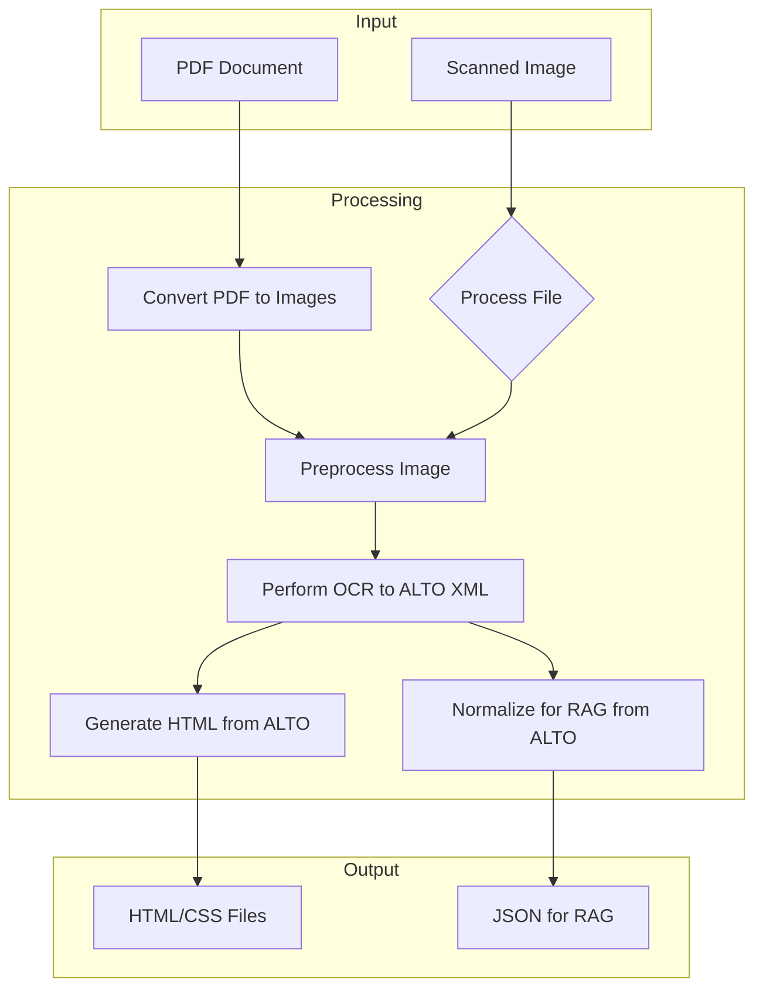

# Historical Newspaper OCR & Layout Preservation Pipeline

This project is a multi-stage pipeline that processes scanned historical newspaper articles and converts them into two high-value digital formats: a web-optimized HTML representation that preserves the original visual layout, and a structured JSON format optimized for ingestion into a Retrieval-Augmented Generation (RAG) system.

## Core Features

-   **High-Fidelity HTML:** Generates HTML/CSS that visually replicates the original newspaper layout, including columns, headlines, and images.
-   **RAG-Optimized Data:** Produces clean, normalized, and structured JSON, where each entry represents a full article, perfect for AI-powered research.
-   **Image Preprocessing:** Enhances raw scans to improve OCR accuracy by handling skew, noise, and uneven lighting.
-   **Traceability:** Links every piece of generated content back to its source location on the original scanned page.
-   **Open-Source:** Built entirely with open-source tools.

## Diagram



## Technology Stack

| Stage                | Tool/Library      | Purpose                                    |
| -------------------- | ----------------- | ------------------------------------------ |
| **Orchestration**    | Python 3.9+       | Master scripting and pipeline control      |
| **PDF Processing**   | PyMuPDF (fitz)    | Extracting pages from PDF documents as images |
| **Image Processing** | OpenCV-Python     | Deskewing, noise reduction, binarization   |
| **OCR Engine**       | Tesseract OCR 5   | Text extraction with layout data (ALTO XML)|
| **HTML Conversion**  | lxml (Python)     | Parsing ALTO XML to generate HTML/CSS      |
| **Text Normalization**| NLTK            | Cleaning and structuring text for RAG      |
| **Data Storage**     | File System       | Output file storage and structured data    |


## Directory Structure

```
.
├── .gitignore
├── LICENSE
├── README.md
├── config.ini
├── main.py
├── requirements.txt
├── src
│   ├── __init__.py
│   ├── generate_html.py
│   ├── normalize_rag.py
│   ├── ocr.py
│   ├── preprocess.py
│   ├── style.css
│   └── utils
│       ├── __init__.py
│       └── logging_config.py
└── tests
    ├── alto.xml
    ├── config.ini
    ├── dummy.pdf
    ├── test_generate_html.py
    ├── test_normalize_rag.py
    ├── test_pipeline.py
    ├── test_pipeline_with_pdf.py
    └── test_run_ocr.py
```

## Getting Started

### Prerequisites

-   **Python 3.9+**
-   **Tesseract OCR 5**: This must be installed and accessible in your system's PATH.
    -   **macOS (using Homebrew):**
        ```bash
        brew install tesseract
        ```
    -   **Ubuntu/Debian:**
        ```bash
        sudo apt-get update
        sudo apt-get install tesseract-ocr
        ```
    -   **Windows:**
        -   Download the installer from the official [Tesseract at UB Mannheim](https://github.com/UB-Mannheim/tesseract/wiki) page.
        -   Ensure you add the Tesseract installation directory to your system's `PATH` environment variable.

### Setup & Usage

1.  **Clone the repository:**
    ```bash
    git clone https://github.com/your-username/your-repo-name.git
    cd your-repo-name
    ```

2.  **Create a virtual environment (recommended):**
    ```bash
    python3 -m venv venv
    source venv/bin/activate  # On Windows, use `venv\Scripts\activate`
    ```

3.  **Install dependencies:**
    ```bash
    pip install -r requirements.txt
    ```

4.  **Prepare your data:**
    -   Place your scanned images (e.g., `.png`, `.jpg`, `.tiff`) or `.pdf` files in a directory (e.g., `data/input`).

5.  **Configure the pipeline:**
    -   Copy the example configuration file: `cp config.ini.template config.ini`
    -   Edit `config.ini` to set metadata like `NewspaperTitle` and `PublicationDate`.

6.  **Run the pipeline:**
    ```bash
    python main.py --input_dir data/input --output_dir data/output --config config.ini
    ```

## Configuration

The pipeline is configured using a `config.ini` file. This file allows you to set parameters for different stages of the pipeline without modifying the source code.

-   **`[Metadata]`**: Defines the newspaper title and publication date, which are embedded in the RAG output.
-   **`[OCR]`**: Controls the OCR engine's settings, such as the Page Segmentation Mode (PSM).
-   **`[Preprocessing]`**: Contains parameters for image preprocessing steps like deskewing and noise reduction.

To get started, copy the template:
```bash
cp config.ini.template config.ini
```
Then, edit `config.ini` to match your project's requirements.

## Project Status

**Alpha:** The core pipeline is functional and ready for testing. It can process images and PDFs, but may still contain bugs or require further refinement.
